# Описание задачи

Я проводил RFM-анализ клиентской базы аптечной сети. 

## Цели и задачи

Основной мотив исследования: скоро сезон активных продаж спадет и выручки в аптеке начнут падать. У компании есть механизм СМС-рассылок, но хотят провести персонализированную рассылку, чтобы не потратить бюджет впустую.

Для этого было проведено исследование клиентской базы аптечной сети с помощью RFM-анализа, который позволил классифицировать покупателей на основании истории их покупок и были сформированы рекомендации, какой группе покупателей что предлагать.

## Об RFM-анализе

RFM-анализ — метод анализа, позволяющий сегментировать клиентов по частоте и сумме покупок и выявлять тех, которые приносят больше денег. Аббревиатура RFM расшифровывается:

* Recency — давность (как давно пользователи что-то покупали)
* Frequency — частота (как часто они покупают)
* Monetary — деньги (общая сумма покупок)

По каждому из этих признаков мы выделяем по три равные группы. Затем присваиваем каждой группе числовое обозначение от 1 до 3.

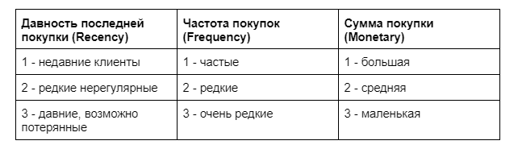

После разделения людей на группы получаем максимум 27 сегментов. Анализ помогает определить клиентов, которые покупают часто и на большие суммы, клиентов, которые регулярно возвращаются за небольшими покупками, и клиентов, которые давно ничего не покупали. Таргетирование рассылок на определенные группы клиентов дает гораздо большую конверсию рекламы, нежели одинаковая не персонализированная реклама.

## Структура базы данных

Для исследования использовалась таблица `Bonuscheques` (БД Аптека), которая содержит информацию о транзакциях по бонусным картам `card` (т.е.это постоянные клиенты, они оставили свои телефоны).

Если в момент покупки касса была в оффлайн-режиме, то вместо номера карты записывается зашифрованная последовательность символов. В таком случае номер карты силами этой базы данных никак восстановить нельзя. Поэтому в исследование взяты покупки, которые можно идентифицировать.

Также из исследования исключены покупатели, сделавшие одну покупку – им нет смысла предлагать персональную скидку для повышения среднего чека.

* `datetime` - дата и время совершения транзакции
* `summ` - сумма чека

Данные для подключения: 

```
Хост: 95.163.241.236
Порт: 5432
База данных: apteka
Юзер: student
Пароль: qweasd963
```

## Выбор метрик для анализа

Основная сложность RFM-анализа — определить границы сегментов, потому что универсальных рекомендаций по этому поводу нет.

В данном исследовании для того, чтобы оценить распределение покупателей, были рассчитаны средние, медианы и перцентили, а также построен `boxplot`.

Среднее – самый популярный статистический показатель, но чувствительный к выбросам, которые смещают среднее значение и могут ввести в заблуждение. Медиана показывает центральное значение в выборке. 

*В нашем случае средняя сумма покупок 5018 руб., медианная сумма 2708 руб. Значения сильно отличаются, и мы можем предположить наличие выбросов (отдельные клиенты покупали на очень большие суммы).*

*Среднее количество покупок 5,7, медианное количество - 3. Можем предположить, что у аптечной сети много разовых покупателей, которых хорошо бы сделать постоянными лояльным клиентами.*

Перцентили позволяют нарезать слоями массив данных и понять, на какие группы делятся элементы. Таким образом, покажут изменения с большей точностью, но спрячут выбросы. 

Для большей точности было сделано распределение по децилям.

Для того, чтобы убедиться в правильности расчетов и посмотреть визуально, было сделано распределение по квартилям (построен боксплот). И подсчитаны кумулятивные сумма и количество заказов, т.к.закон Парето про 80/20.

В исследовании по каждому из трех параметров разделили покупателей на 3 группы. В результате получились вот такие сегменты:

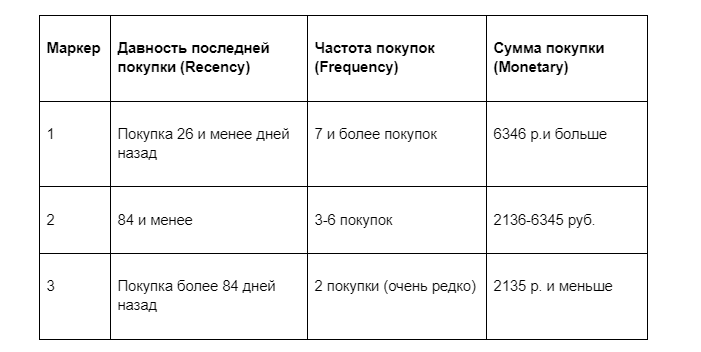

Почему выбраны именно эти границы сегментов?

Всего период, который взят для анализа - полтора года (можно выбрать другой временной период с помощью фильтра на дашборде). Этого отрезка времени достаточно:

* чтобы можно было сделать ретроспективный анализ
* не тратить сила на совсем уж давних клиентов, потому что клиенты могли исчезнуть потому что переехали, сменили работу, и им стало неудобно, или сменили телефон, и бюджет будет тратиться впустую на рассылку по неактуальным номерам

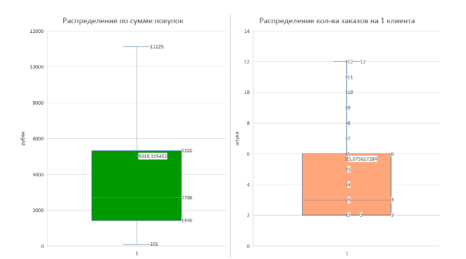

### Давность последней покупки (Recency) 

Из распределения по децилям видно, что 30% клиентов - те, у кого последняя покупка была 26 и меньше дней назад. Т.е.это постоянные клиенты и новые, которые были недавно и аптечная сеть хочет, чтобы они пришли снова.  Это самая “свежая” группа 1.

Медиана (62 дня) и среднее (85 дней). Т.е.30% клиентов относим в среднюю категорию.

Те, кто не приходил в аптеку более 85 дней (почти 3 месяца) дней попадают в группу 3, потому что это либо в принципе редкие посетители аптек (например, молодые люди), либо те, кому стало территориально неудобно, либо ушедшие к конкурентам. 

**Распределение количества дней после последней покупки (“пропущенных” дней)**

https://metabase.simulative.ru/question/701-raspredelenie-kolichestva-dnej-posle-poslednej-pokupk 

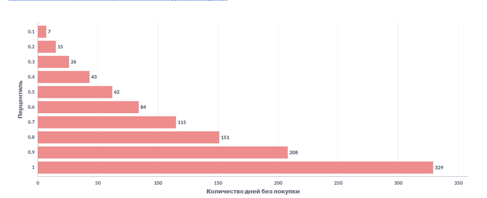

### Частота покупок (Frequency)

Достаточно много разовых клиентов (33%), принесших 11,5% от общего количества посещений. Они самые “холодные”, поэтому группа 3.

Есть клиенты, которые за полтора года приходили 7 и более раз (23% от общего количества покупателей, как видно из распределения по децилям. Их количество покупок 51,65% от общего количества покупок (накопительный итог)). Такие лояльные и постоянные клиенты получают категорию 1.

Медианное количество покупок - 3. Это основной пул клиентов (44 %). Среднее 6. Накопительный итог - 89%, т.е.это подтверждает, что большая часть покупателей сделала от 3 до 6 покупок за период. Категория 2.

**Распределение количества покупок на одного клиента**

https://metabase.simulative.ru/question/717-raspredelenie-kolichestva-pokupok-na-odnogo-klient 

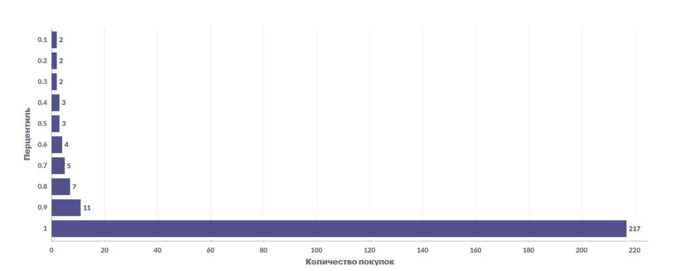

### Сумма покупки (Monetary)

Из соотношения медины и среднего можно понять наличие выбросов, поэтому к среднему надо относиться с осторожностью. Из распределения и накопительного итога мы видим, что 60% продаж приносят 20% покупателей, которые покупали на сумму 6346 и более руб. Категория 1.

Категория 2 - основная масса клиентов, которая покупает на сумму от 2136-6345 руб. Вместе с категорией 1 они приносят 90% продаж (накопительный итог), составляя 60% клиентов (четвертый дециль).

В эти границы попадает медиана (2708 р.) и среднее (5018 р.).

Категория 3 - оставшиеся 40% клиентов. которые приносят всего 10% продаж.

**Распределение суммы покупок на одного клиента**

https://metabase.simulative.ru/question/716-raspredelenie-summy-pokupok-na-odnogo-klienta 


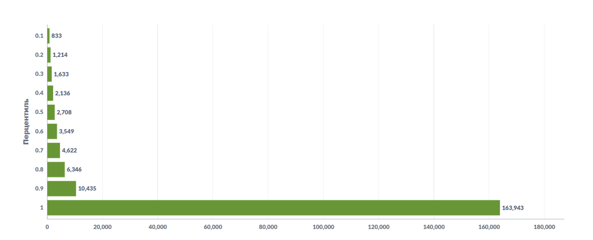

Некоторые сегменты есть смысл объединить, если они очень маленькие по количеству покупателей или сходны по стратегии работы с ними.

У отдела маркетинга тоже очень много задач и написать 27 вариантов работы с группами, в которых 10-50 человек - и затратно, и может возникнуть путаница при отправке сообщений, ну и вряд ли эти 27 вариантов будут как-то концептуально отличаться между собой, т.е.может получиться “работа ради работы”, а не результата.

Поэтому покупатели были объединены в 7 логических групп:

https://metabase.simulative.ru/question/842-rfm-analiz-raspredelenie-klientov-na-7-grupp-doli-kazhdoj-grupp 

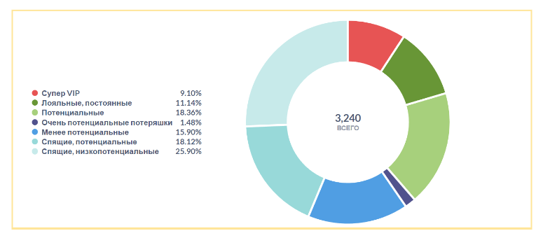

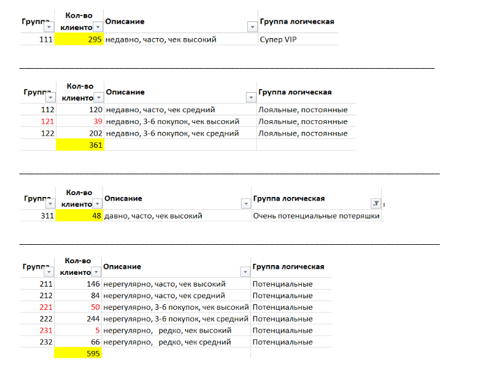

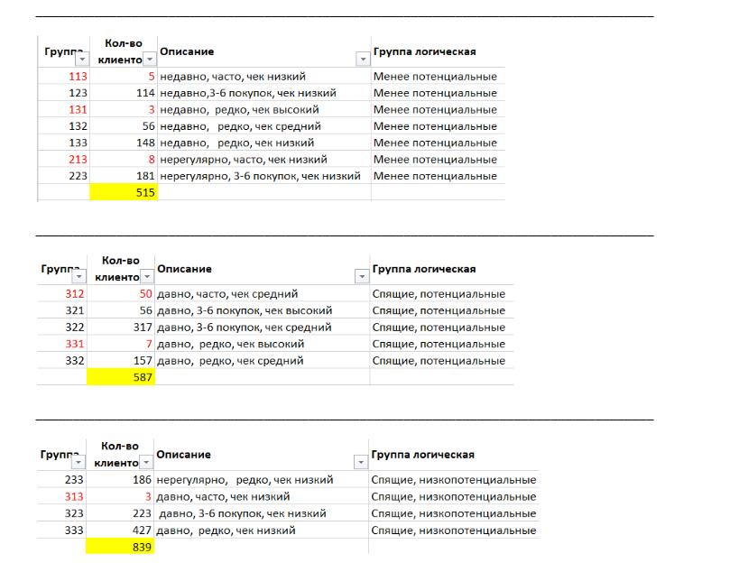

## SQL-запросы

[👉🏻**ССЫЛКА НА ДАШБОРД**👈🏻](https://metabase.simulative.ru/dashboard/149-rfm-analiz-klientskoj-bazy-seti-aptek-dashbor#refresh=3600)

**RFM-анализ. Таблица итоговая с присвоением категории каждому клиенту**

https://metabase.simulative.ru/question/707-rfm-analiz-tablica-itogovaya 

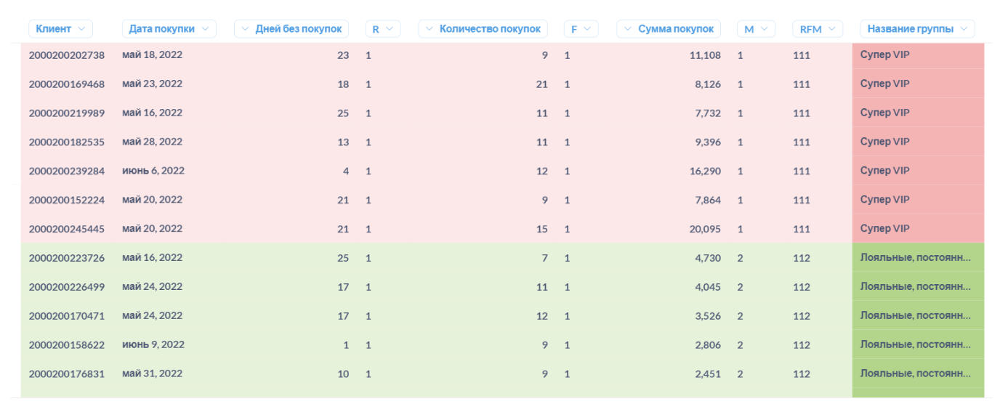

## Выводы

В результате проведенного RFM-анализа клиентской базы аптечной сети были сформированы 7 групп покупателей для рассылки смс-сообщений с целью увеличить чек и частоту покупок.

Распределение покупателей получилось удобным и похожим на распределение по правилу Парето, которое уважаемо и применимо в работе в условиях ограниченных ресурсов, человеческих и денежных. А ресурсы ограничены всегда.

https://metabase.simulative.ru/question/842-rfm-analiz-raspredelenie-klientov-na-7-grupp-doli-kazhdoj-grupp 

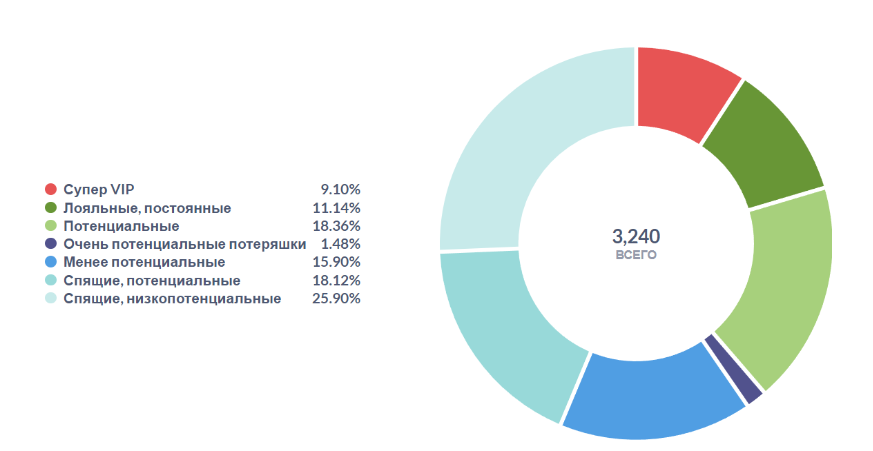

Группы достаточно большие, чтобы не распылять силы, но при этом объединены по своему поведению.

**Фокусы глобально:**

1. Увеличить частоту посещения аптеки
2. Увеличить средний чек

**Это можно сделать, проведя клиентов по маркетинговой воронке лояльности:**

⏬ - сделать “холодных” клиентов “теплыми” постоянными
⏬ -  “теплых” и “потеплевших” -  “горячими”
⏬ - “горячих”  склонить к покупке и сделать VIPами
⏬ - VIPов сделать амбассадорами, чтобы они привлекали в аптеку своих родственников и знакомых

**Теперь подробнее:**

1) создать широкий охват людей в верхней части воронки: разбудить две группы спящих и привлечь новых клиентов.

Как мы увидели из RFM-анализа - редких покупателей у аптечной сети многовато, и фокус на перевод случайных покупателей в регулярные - самый важный, потому что, даже при низком чеке, покупатели - это выручка и будущие лояльные клиенты. 

**Спящие потенциальные (18,1%)**

Они покупали на достойные суммы, но куда-то пропали. Это одна из самых важных групп, потому что их можно конвертировать в группу активных покупателей.

Надо про нас напомнить и дать какую-то заманушку:

* предложения в стиле “до даты Х двойные бонусы”; 
* начислены дополнительные бонусы по карте и они сгорят числа Y; 
* акция по снижению стоимости на препараты ABC до числа Х”. 

Т.е.надо прийти в аптеку до определенного времени.

**Спящие низкопотенциальные (25,9%)**

Давние, по сути разовые, покупатели, покупали по-мелочи. С ними могло случиться все что угодно, например, территориальные изменения (ну не пойдет человек в аптеку далеко от дома или работы). Мог смениться номер - тогда бюджет, потратится в никуда. Могла сильно не понравиться сама аптека. Или это молодые люди богатырского здоровья, которые крема-шампуни-презервативы покупают на Вайлдбериз. 

Риски: бюджета надо много, а результата может быть мало.  Если кто-то и вернется - то окупит ли это затраченные на них средства? 

Возможности: все же получить постоянных покупателей. В этой группе много 2-х разовых клиентов, по сути - случайных. Но, если пришел 2 раза, а не один - значит не такой уж он и случайный? Может, он живет рядом, но ходит в другую аптеку и его лояльность можно развить?

Может клиент не знает, что аптека - это не только лекарства, но и парафармация? Аптеке больше доверия, чем непонятному продавцу с маркетплейса.

Клиент считал аптеку дорогой - вот смс об акции, что цена доступная. Клиент переехал и перестал ходить в аптеку - так есть другие аптеки сети рядом.

Можно предлагать акции на парафармацию, скидку при регистрации в приложении, приветственные баллы при оформлении карты.

*Для холодных клиентов и, т.к. лек.препараты и парафармация - продукт специфический, к его рекламе нужно подойти более фундаментально, чтобы объяснить потенциальным клиентам его ценность. Например, рассылка новостей или научно-популярных статей. Такая реклама создает меньше ощущения продажности, чем контент для маркетинга, поэтому она может быть более привлекательным способом оставаться на связи с клиентами и стимулировать посещение сайта, чтение обзоров продуктов или обращение за дополнительной информацией.*

*Могу предположить, что компания подключает на этом этапе и другие инструменты, кроме смс-рассылки (заказы через личный кабинет на сайте, поисковую оптимизацию для интернет-запросов, ретаргетинг и поп-апы с предложениями скидок, соцсети и другие способы повышения осведомленности).*

*Отдельно хотела бы отметить (это не относится непосредственно к поставленной задаче, но аналитик может помочь) важность удержать вновь пришедших клиентов: удобство сайта и личного кабинета, простота регистрации и оформления покупок и т.д. Узнать об этом можно можно из опросов для постоянных покупателей.*

2) Три группы потенциальных “тёплых” клиентов

**Потенциальные (18,3%)**

Платежеспособные клиенты, которые покупают нерегулярно. Основная цель - чтобы приходили чаще. Нужно периодически напоминать о товарах компании, рассказывать о новых продуктах, отправлять уведомления об акциях. Хорошо  - когда надо прийти в аптеку до определенного времени (бонусы сгорят, акция до числа Х и тд.).

**Менее потенциальные (15,9%)**

Покупают на меньшие деньги, чем Потенциальные. Цель - увеличить сумму и частоту их покупок. Подойдут акции “купи 2, получи третий в подарок”, о снижении цены, начисление бонусных баллов на какую-либо категорию товаров.

**Очень потенциальные потеряшки (1,5%, 48 человек)**

Покупали давно последний раз, но часто и на большие суммы. Основная задача — реактивировать, снова сделать их супер лояльным, как-то о них позаботиться (персонализированные супер-акции). Эта группа маленькая, но она заслуживает отдельного внимания, т.к.может перейти в категорию Супер VIP и внести хороший вклад в прибыль. И супер-акция обойдется недорого, т.к.клиентов в этой группе мало.

3) Лояльные клиенты

**Супер VIP (9,1%)**

Это абсолютные лидеры среди клиентов. Они приносят существенную долю выручки компании + могут быть неплохим источником сарафана. Это категория «главные фанаты». 

Хорошо было бы прислать им что-то супер персонализированное, заказать под них что-то, что они регулярно покупают, позаботиться о них, дать бы им VIP карту и так далее. Сделать что-то, чтобы у них случилась реакция «нифига себе» и они побежали рассказывать об аптечной сети друзьям. Рекомендации повышают вероятность того, что люди попробуют приобрести, и, как правило, приводят к более быстрой конверсии.

**Лояльные, постоянные (11,1%)**

Это тоже группа лидеров. Уже приносят аптечной сети основной доход и могут прирасти еще. Им можно предлагать новинки, приглашать подписаться на соцсети, проводить с ними опросы. Цель работы с группой - повысить их средний чек за счет того, что они узнают о новых для них товарах. 

Категориям лояльных клиентов не надо очень часто делать рассылку, чтобы она не воспринималась как спам. Эти клиенты и так часто приходят. 
Можно уделять меньше внимания знакомству с брендом или продуктом, особенно если это товар широкого применения.
Можно создать реферальную программу, которая привлекает клиентов, которые приводят новых клиентов, например, предлагая скидку друзьям и родственникам вашего клиента.
Проводить опросы  - здесь сразу две возможности:

* демонстрация того, что вам небезразлично мнение клиентов
* по результатам можно будет понять, какие покупатели предпочитают совершать покупки, сможем уточнить свое представление об идеальной целевой аудитории и сформировать акции с наибольшей вероятностью конверсии

Сделать улучшения: если опрос выявит области, которые создают проблемы для клиентов, такие как неудобства при покупках, потребности по ассортименту, недовольство работой сотрудников аптеки, можно устранить их и выполнить глобальные фокусы (увеличить частоту посещения аптеки и увеличить средний чек).


